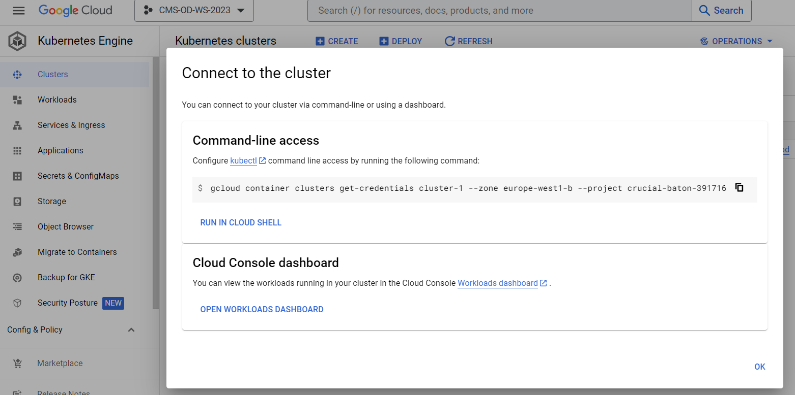

## Access your GKE Cluster
For the CMS-Workshop 2022 we have added you to a GCP project where we will provide temporary resources to run an Argo Workflow. Before we get into details please follow the following steps to get things started!

### Find your cluster
* Go to the [Google Cloud Console](https://www.google.com/url?sa=t&rct=j&q=&esrc=s&source=web&cd=&cad=rja&uact=8&ved=2ahUKEwiT1aCX6av5AhWKtYQIHYGlASQQjBB6BAgEEAE&url=https%3A%2F%2Fconsole.cloud.google.com%2F%3Fhl%3Des&usg=AOvVaw32wCy6el4RVbIZO1m5wyNI) and login with your google account.
* Verify that you are in the [CMS-opendata Project](https://console.cloud.google.com/welcome?project=cms-opendata).

* Go the Kubernetes engines cluster listing from the Navigation menu top left, scroll down to "Kubernetes engine" and select "Clusters".

* Find the number of your cluster in the email you have received and select your cluster in the list.

### Resize your cluster
* The cluster has been created with one node only to limit the costs. Now as you start using the cluster, [resize](https://cloud.google.com/kubernetes-engine/docs/how-to/resizing-a-cluster) your cluster to ```4 nodes```:
  * Click on the three vertical dots after your cluster name and select "Edit".

  * Choose Nodes.

  * Then click on the Node pools name "terraform...".

  * Select "Resize".

  * Set the number of nodes to 4.


### Connect to the cluster
* Now go back to the cluster listing page, click on the three vertical dots and choose connect.

* Click on "RUN IN CLOUD SHELL" to connect to your cluster.

* In the cloud shell press Enter after the command and authorize cloud shell in the pop-up window that opens

* If requested, submit the command `gcloud auth login` and follow the link the get the authorization code.

## Argo

### Argo command-line interface
Argo components are already running on the cluster! But to submit the workflow from the cloud shell, you will need the argo command-line interface. You can download the binary and move it to it's respective path with the following commands:

```bash
curl -sLO https://github.com/argoproj/argo/releases/download/v2.11.1/argo-linux-amd64.gz
gunzip argo-linux-amd64.gz
chmod +x argo-linux-amd64
sudo mv ./argo-linux-amd64 /usr/local/bin/argo
```

### Submit the workflow
Now fast forward: to make sure that the workflow makes it in time to finish during the hands-on session, submit it right now. We will explain the details while the workflow is running.

Get the workflow file with

```bash
wget https://raw.githubusercontent.com/cms-opendata-analyses/PhysObjectExtractorTool/odws2022-ttbaljets-prod/PhysObjectExtractor/cloud/argo-poet-ttbar.yaml
```

The workflow defines the persistent volume in which the output is stored. Edit the workflow to replace `<NUMBER>` to correspond to your cluster number. 

Then submit the workflow with

```bash
argo submit argo-poet-ttbar.yaml -n argo
```

Check that it got running with

```bash
argo get @latest -n argo
```


## Get your services
Your cluster has been built altogether with [Terraform](https://www.terraform.io), including all the configurations seen in the [cloud pre-exercises](https://cms-opendata-workshop.github.io/workshop2022-lesson-introcloud/). 

To get the external IP of both the `Argo GUI` (with which you can follow the workflow) and the `http server` (through which you can download the ouputs), run the following command:

```bash
kubectl get svc -n argo
```

### Argo GUI
In a new tab open ```https://<EXTERNAL-IP>:2746```, replacing `<EXTERNAL-IP> with corresponding external IP of your `argo-server-N` from the ouput of the command above.

### Http File Server
In a new tab open ```<EXTERNAL-IP>```, no need to add anything, just paste the external IP of your `http-fileserver-N` from the ouput of the command above.


## Next

OK, we got it running! Now let's go to see the details...



