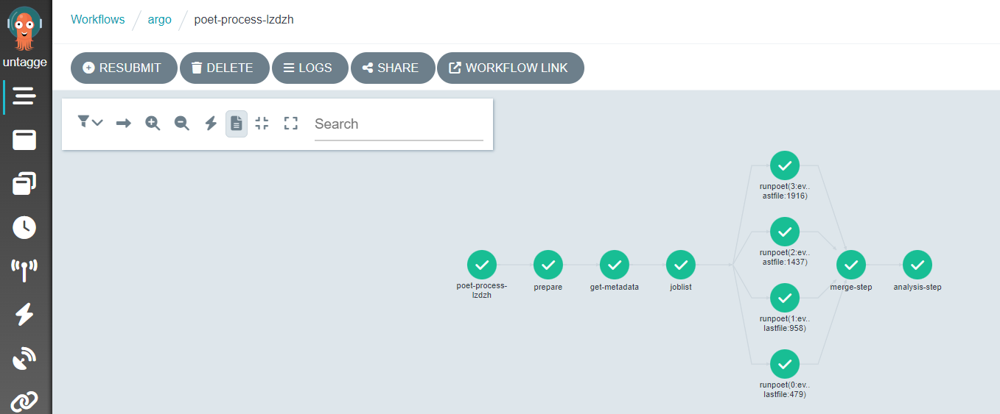

## Follow the workflow progress 

You can watch the progress of the workflow either on the command line or in the Argo GUI.  

On the command line, you can see the state of the workflow with

```bash
argo get @latest -n argo
```

and you can check the logs with

```bash
argo logs @latest -n argo
```

You can also get the logs from the pods (take the pod name from the listing of `argo get...` output) using 

```bash
kubectl logs <pod-name> -n argo
```

You check the status of the pod

```bash
kubectl describe pod <pod-name> -n argo
```


When the workflow  has finished, you will be able to access the output files from the http file server. You can also see the contents of the disk with

```bash
kubectl exec pv-pod -n argo -- ls /mnt/data
```


## Expanding the Yaml File

In the previous section, you downloaded a workflow definition and submitted it. It should now be running. This workflow corresponds to the analysis example presented in this workshop.

The workflow mimicks a full analysis, first processing CMS open data samples with POET and then running an analysis script on the output files.

Open up the file [argo-poet.yaml](https://github.com/cms-opendata-analyses/PhysObjectExtractorTool/blob/odws2023/PhysObjectExtractor/cloud/argo_poet.yaml), and take a look through its contents. Below is an explanation of the major steps.

The workflow calls and runs multiple different tasks. The file is broken up into different templates. Note that each task runs in a container, and the workflow is using the same container images that we have been using in the workshop. 

1. **cms-od-example**, the first template, is the entrypoint, and it contains the outline for the rest of the workflow. The listing under `dag` defines the inputs and outputs of each step and their dependencies.

2. **prepare-template** gets the directories ready for other workflow steps.  

3. **get-metadata-template** uses `cernopendata-client` to get the metadata of the dataset.

4. **joblist-template** prepares an array that the next step would iterate over.

5. **runpoet-template** processes the data, and it will take the longest amount of time to complete.  

6. **merge-step-template** combines the inputs from the jobs of the previous steps into a single file. 

7. **analysis-step-template** creates some histograms to check that the processing went OK.

The "runpoet" step takes the array of the preceding step as input and iterates over it. It runs multiple jobs at the same time.  The Argo GUI helps us visualize this process.



Depending on the resources you allocate to your cluster, there is a limit to the number of pods you have running at one time.  If you have more pods than this number, they will wait for each other to complete.  


### Workflow input parameters
The workflow takes the following parameters:

```yaml
  arguments:
    parameters:
    - name: startFile                                  
      value: 1
    - name: nEvents                               
      value: 10000
    - name: recid
      value: 24119
    - name: nJobs
      value: 4
```

and they need to be defined as part of the first template:

```yaml
  templates:
  - name: cms-od-example
    inputs:
      parameters:
      - name: startFile
      - name: nEvents
      - name: recid
      - name: nJobs
```

They give input to the workflow steps.  
- `startFile` is the first file in the list to be processed
- `nEvents` is the number of events to be processed
- `recid` is the dataset to be processed.
- `nJobs` is the number of separate jobs

This implementation is mainly for small-scale testing but in principle can be run with any number of events and jobs.

### Getting metadata

The metadata are retrieved using the [cernopendata-client](https://cernopendata-client.readthedocs.io/en/latest/) container image. It is available also as a command-line tool. Task `get-metadata` make the following queries:

- `cernopendata-client get-file-locations --recid "{{inputs.parameters.recid}}" --protocol xrootd` for a listing of all files in a dataset
- `cernopendata-client get-metadata --recid "{{inputs.parameters.recid}}"  --output-value type.secondary` the type of data (Collision/Simulated)
- `cernopendata-client get-metadata --recid "{{inputs.parameters.recid}}"  --output-value distribution.number_files` for number of files in the dataset.
 
Leaving out the `--output-value` option would give all metadata, which could also be inspected directly from the open data portal records by adding `/export/json` to the [record URL](https://opendata.cern.ch/record/24119/export/json).


### Passing information from one task to another

The main challenge in any workflow language is the communication between the tasks. This workflow implementation illustrates some of the possibilities when using Argo as a workflow language:

- a mounted volume `/mnt/vol`, available as a `persistent volume` to all tasks - used for files
  - the persistent volume claim is defined in the beginning with
  
    ```yaml
    volumes:
    - name: task-pv-storage
      persistentVolumeClaim:
        claimName: nfs-<NUMBER>
    ```
    
  - it can then be used in those steps that need access to it with

    ```yaml
      volumeMounts:
      - name: task-pv-storage
        mountPath: /mnt/vol
    ```
    
- input parameters - used for configurable input parameters 
  - they are defined for each step in the `dag` section, e.g.

    ```yaml
      - name: get-metadata
        dependencies: [prepare]
        template: get-metadata-template
        arguments:
         parameters:
          - name: recid
            value: "{{inputs.parameters.recid}}"
    ```
 
  - and later in the workflow in the step implementation

    ```yaml
     - name: get-metadata-template
       inputs:
         parameters:
         - name: recid
    ```
    
- output parameters - used to pass the output from one task to another through a defined parameter
  - they are defined in the `dag` section, e.g.

    ```yaml 
          - name: dataType
            value: "{{outputs.parameters.dataType}}"
    ```

  - and in the step implementation in which they must have a default value:
 
    ```yaml
      outputs:
        parameters:
        - name: dataType
          valueFrom:
            default: "default"
            path: /tmp/type.txt

    ```     
    
- output to stdout - used to pass the stdout output of one task to another.

## Getting the output

When the workflow has finished, you will see the output in the [http file-server](https://cms-opendata-workshop.github.io/workshop2023-lesson-cloud/01-introduction/index.html#http-file-server) browser window. Please note that each download costs money so do not download big files repeatedly for this workshop hands-on exercise.

## Remarks

This is an example workflow for demonstration purposes. To keep it simple, it does not include any error handling or extensive bookkeeping. It is, however, a typical processing task that we envisage CMS open data users to be interested in.

We have implemented this example in Argo. There are many other workflow languages available, and Argo is only one of them. 

