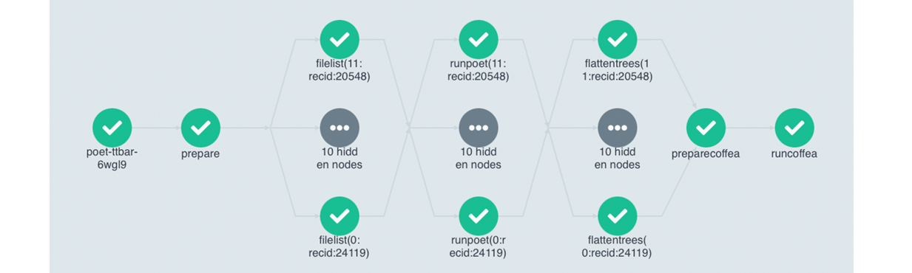
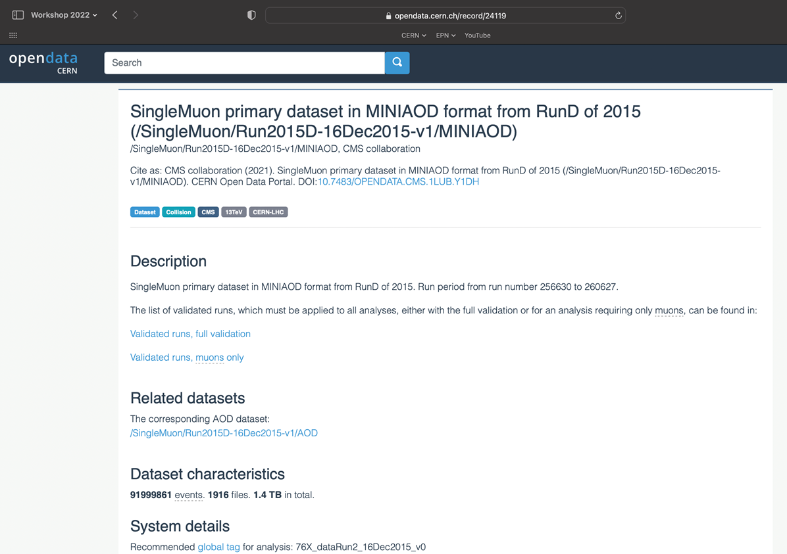

## Expanding the Yaml File

In the previous section, you downloaded a workflow definition and submitted it. It should be now running. This workflow corresponds to the analysis example presented in this workshop.

The workflow mimicks a full analysis, first processing CMS open data samples with POET and then running analysis script on the ouput files.

Open up the file `argo-poet-ttbar.yaml`, and take a look through its contents. Below is an explanation of the major steps.

`argo-poet-ttbar.yaml` calls and runs multiple different tasks. The file is broken up into different templates.  

1. "argo-poet", the first template, is the entrypoint, and it contains the outline for the rest of the workflow.

2. "prepare-template" gets the directories ready for other workflow steps.  

3. "filelist-template" uses `cernopendata-client` to get all files of the datasets.  

4. "runpoet-template" processes the data, and it will take the longest amount of time to complete.  

5. "flattentrees-template" combines the separate "branches" of the POET output ROOT file to one "Events" branch.  

6. "preparecoffea-template" prepares the input to the analysis steps.  

7. "runcoffea-template" runs the analysis.

The first template must have the same name as the the entrypoint value, which is declared close to the top of the file.  Under the `dag` section of the first template, it calls other templates that are defined below.  It also contains information such as arguments to pass into each of these sections and dependencies that ensure the templates are run in the correct order.

The fifth template uses scattering to run the analysis.  It runs the code specified within in mutliple pods at the same time.  The Argo GUI helps us visualize this process.



Depending on the resources you allocate to you cluster, there is a limit to the number of pods you have running at one time.  If you have more pods than this number, they will wait for eachother to complete.  

## Accessing and using datasets

Tho access the dataset file listing you will need its record number or `recid`, which can be found in the end of the url of the dataset on the CERN Open data portal. For example, in the dataset shown below, the [recid is 24119](https://opendata.cern.ch/record/24119).



The workflow takes the following parameters:

```yaml
arguments:
parameters:
      - name: nFiles
        value: 2
      - name: recid
        value: |
          [
            {"recid": 24119},
            {"recid": 24120},
            {"recid": 19980},
            {"recid": 19983},
            {"recid": 19985},
            {"recid": 19949},
            {"recid": 19999},
            {"recid": 19397},
            {"recid": 19407},
            {"recid": 19419},
            {"recid": 19412},
            {"recid": 20548}
          ]
      - name: nJobs
        value: 1
```

They give the input to the workflow steps.  
- `nFiles` is the number of files in each dataset you want to process. It is limited to 2 in this workflow. In real analysis you would run over all files.
- `recid` is the list of dataset to be processed.
- `nJobs` is one (to use it properly, the workflow definition will need to be updated).

You can watch the progress of the workflow either on the command line or in the Argo GUI.  

On the command line, you can see the state of the workflow with

```bash
argo get @latest -n argo
```

and you can check the logs with

```bash
argo logs @latest -n argo
```


When it has finished, you will be able to access the output files from the http file server. You can also see the contents of the disk with

```bash
kubectl exec pv-pod -n argo -- ls /mnt/data
```

Note that this is just an example workflow for demonstration purposes. The workflows can be customized to fit a variety of needs.  Now you are able to edit a yaml file to perform a full analysis flow.
