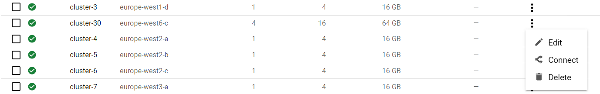
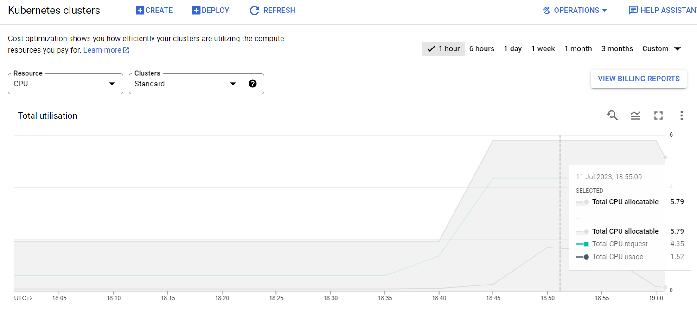

## Getting back to your cluster

Get to your cluster through the [Google Kubernetes Engine page](https://console.cloud.google.com/kubernetes/list/overview?project=crucial-baton-391716) page.

Select your cluster and connect.



Open the cloud shell. The files that you had in the cloud shell are still available, but you will need to copy the argo executable to the path:

```bash
# Move binary to path
sudo cp ./argo-linux-amd64 /usr/local/bin/argo

# Test installation
argo version
```

## Challenges

Choose one or more of the following challenges:

> ## Challenge 1
> Change the workflow to run over `/SingleElectron/Run2015D-08Jun2016-v1/MINIAOD`
> 
> > ## Solution
> >  - Find the dataset and identify its `recid`. Use the [search facets](http://opendata.cern.ch/search?page=1&size=20&type=Dataset&subtype=Collision&year=2015&experiment=CMS) to find all MINIAOD collision datasets from 2015.
> >  - Change the input recid value in `argo_poet.yaml`.
> {: .solution}
{: .challenge}

> ## Challenge 2
> Change the resource request to better match our cluster configuration.
>
> If we look at the cost optimization of the cluster, we see that the choice of `750m` for the CPU request was not optimal:
>
> {:width="70%"}
> 
> > ## Solution
> > - Read the documentation about [kubernetes resource requests](https://kubernetes.io/docs/concepts/configuration/manage-resources-containers/).
> > - Choose a different value for the resource request `cpu: 750m` in `argo_poet.yaml` and see how it changes the scheduling and resource usage.
> > - You can see the nodes on which the pods run with `kubectl get pods -n argo -o wide`
> > - You can see the resource usage of the nodes with `kubectl top nodes` and that of pods with `kubectl top pods -n argo`  
> {: .solution}
{: .challenge}

> ## Challenge 3
> Change the processing step to use your own selection. For example, you may not want to have the PF candidate collection (`packedPFCandidates`) included because it makes the output file very large.
> 
> > ## Solution
> >  - Make your own fork of the [POET repository](https://github.com/cms-opendata-analyses/PhysObjectExtractorTool/tree/odws2023) and move to `odws2023` branch.
> >  - Modify the configuration file `PhysObjectExtractor/python/poet_cfg_cloud.py`: remove `process.mypackedcandidate` from the two `cms.Path` at the end of the file.
> >  - Change the runpoet step in the workflow file to clone from your repository.
> {: .solution}
{: .challenge}

> ## Challenge 4
> Change the analysis step to plot different values. For example, you may want to plot some values from the PF candidate collection, such as their number and the pdg id's.
> 
> > ## Solution
> >  - Make a fork of the POET repository and move to `odws2023` branch.
> >  - Modify the analysis script `PhysObjectExtractor/cloud/analysis.C` for your needs.
> >  - Change the analysis step to your code.
> >    - You can use this [simple plotter](https://github.com/cms-opendata-workshop/workshop2023-lesson-cloud/blob/gh-pages/files/analysis_challenge.C) as an example.
> >    - If you do not intend to change the actual processing, it is enough to have that file alone in a repository (or any other location from which you can get it with `wget` or `curl -LO`), it does not need to be a fork from the POET repository.
> >    - Remember that you need to use the GitHub `raw` view to get the file if you are not cloning the repository.
> >  - Change the analysis step in the workflow file to get the file from your repository.
> > 
> {: .solution}
{: .challenge}

