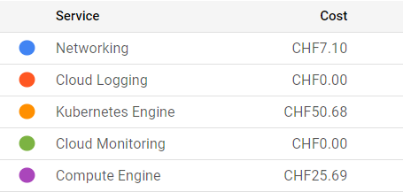

We have run through an example of CMS open data processing on public cloud resources. Now it is time for some preliminary considerations on costs. 

## Cost and time
The charges in cloud computing come from the cluster, disk space, and networking. They are based on the time that resources are available and/or on their size. An example of billing details covering the preparations and the first cloud tutorial session:

For this workshop, we are using a scalable max 4-node cluster that can efficiently run at least two parallel jobs (pods) on each node. The pricing depends on the zone, and whether we've chosen to allow nodes on "[Spot-VMs](https://cloud.google.com/kubernetes-engine/docs/concepts/spot-vms)", i.e. VMs that may get deleted on short notice. For our chosen solution, the price is approximately 0.2-0.3 USD/hour and it shows under "Kubernetes Engines". The estimated cost is visible during the cluster creation on the GKE web interface. Note that the "autopilot" clusters are not a choice because their settings do not allow using the nfs disk as we do it.

For the persistent disk, we've selected a standard 100 GB disk that costs approximately 0.04 USD/GB/month depending on the zone. In addition, each cluster node creates a 100 GB disk that gets deleted when the node is deleted. Some care is to be taken when setting things up as a more expensive "balanced" disk appears as default. The costs related to disks appear under "Compute Engine". The GCP documentation provides an [overview of disk costs](https://cloud.google.com/compute/disks-image-pricing#disk).

Uploading ("ingress") and downloading ("egress") data to and from a cloud provider has cost. This appears under "Networking". In our case, these are the costs related to the Argo GUI and the file server through a "load balancer". You can use the [GKE pricing calculator](https://cloud.google.com/products/calculator) to estimate all costs, including download in the Networking Egress tab.

As an example, running over 1M of events (1%) in our chosen dataset took 1 hour 10 mins to run, and the resulting output file, including the full list of [particle flow candidates](https://cms-opendata-workshop.github.io/workshop2023-lesson-advobjects/02-particleflow/index.html), is 4.6 GB.

## Further optimization

### Resource requests
A kubernetes resource can have some resource requests in terms of CPU and memory. In our workflow, we requested a certain minimum amount of CPU for the heaviest CMSSW task. This is necessary to make the cluster autoscale, i.e. increase the number of nodes when needed. Much further optimization could be done for the best choice of resource requests and limits.

### Container pull
Pulling the container from the docker of GitLab image registry takes approximately 6-7 minutes for each job. It would be worth studying whether uploading the container image to the cloud provider's registry makes it faster. The cost of uploading and storing the image would need to be evaluated.

### Data upload
We have not estimated whether it would be convenient to upload the data to the cloud provider's disk. It will certainly make the data access for processing faster, but the cost to upload ("ingress") and host some TB of input data needs to be taken into account. 

### Data download 
Downloading data from cloud resources ("egress") is not free. For quick checks of the workflow, you would rather have a lightweight output, i.e. a plot instead of a full histogram file. The final cost estimate needs to include the costs to download the full output data.

## Free resources
Most cloud providers offer some initial free resources that can be used for a limited time. Some of them remain free even after the initial trial period, but have a limit of free use in a given time. This is the case for the cloud shell which we used to access the cluster, its free use is limited to 50 hours per week. Note that you can also access [GKE clusters using the gcloud CLI](https://cloud.google.com/kubernetes-engine/docs/how-to/cluster-access-for-kubectl) from your own computer.

## Next steps
For the hands-on session, we provided clusters that already had part of the machinery installed. For a walk-through of the environment setup from scratch, read through the [Cloud post-exercise](https://cms-opendata-workshop.github.io/workshop2023-post-lesson-cloud/).

